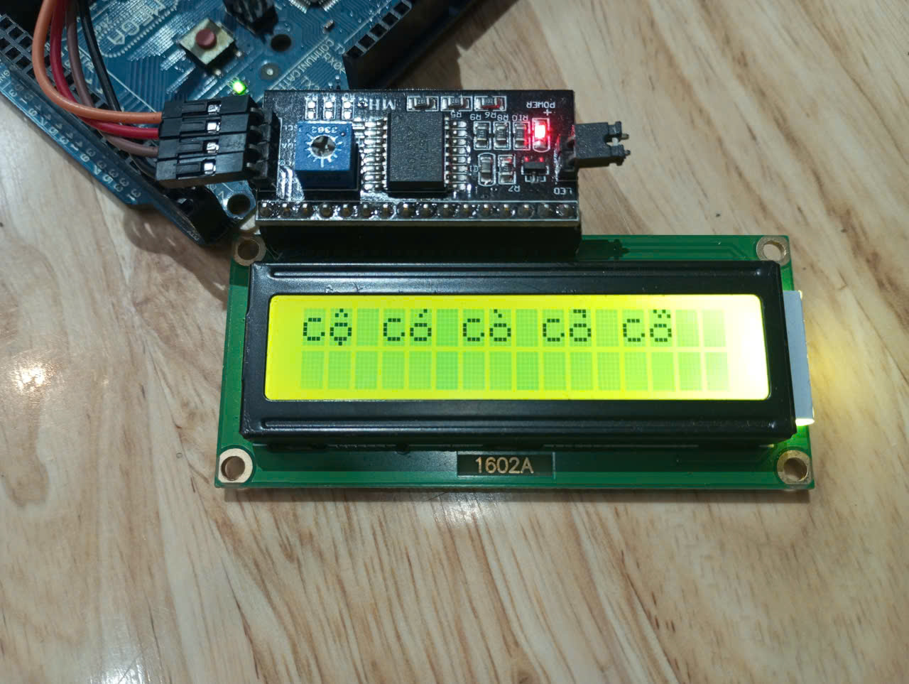
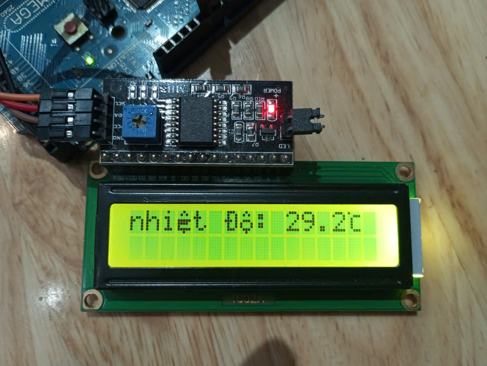
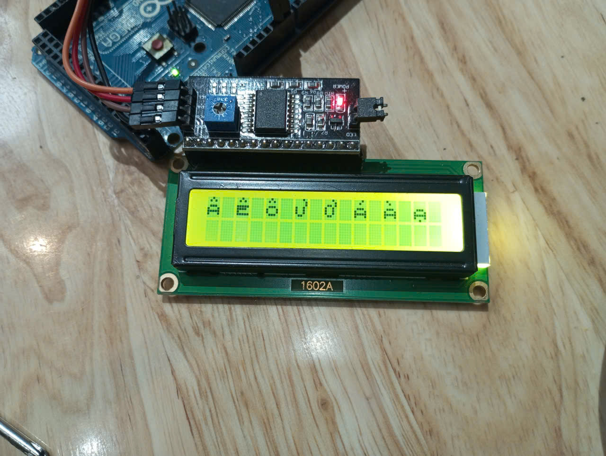
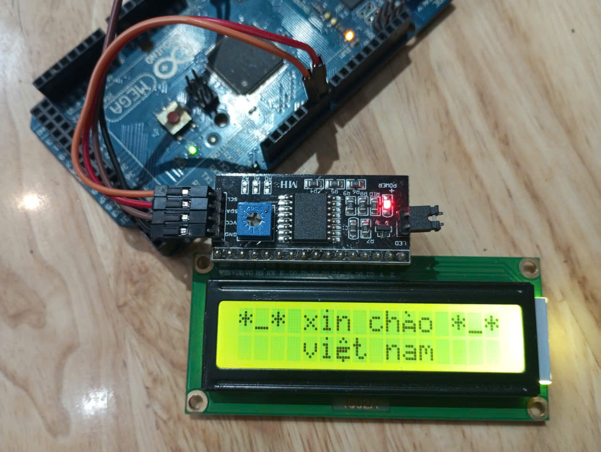

# VN_LCD
[](http://downloads.arduino.cc/libraries/logs/github.com/HuuPhuoc2411/VN_LCD/)
<br>
`VN_LCD` là thư viện Arduino cho màn hình LCD ký tự 16x2 dùng chip HD44780 và module I2C PCF8574. Thư viện tập trung vào một việc chính: cho phép bạn truyền trực tiếp chuỗi tiếng Việt UTF-8 có dấu vào `lcd.print()` và hiển thị lên LCD 16x2 theo cách dễ đọc nhất trong giới hạn 5x8 pixel của mỗi ô ký tự.

Thư viện dùng được cho Arduino AVR như Uno, Nano, Mega, đồng thời hỗ trợ ESP8266 và ESP32. Bạn có thể dùng I2C mặc định hoặc tự cấu hình chân SDA/SCL bất kỳ bằng I2C mềm.

## Hình Ảnh Thực Tế

Bạn có thể thay các đường dẫn ảnh bên dưới bằng ảnh LCD thực tế của dự án.

| Hiển thị tiếng Việt | Hiển thị nhiệt độ |
| --- | --- |
|  |  |

| Hiển thị nhiều dấu | In chữ xin chào Việt Nam |
| --- | --- |
|  |  |

## Tính Năng Chính

- Hiển thị tiếng Việt có dấu trực tiếp từ chuỗi UTF-8, ví dụ `lcd.print("nhiệt độ:")`.
- Không phân biệt chữ hoa và chữ thường. Thư viện tự chuẩn hóa kiểu chữ để ưu tiên dễ đọc trên LCD 16x2.
- Hỗ trợ Arduino AVR, ESP8266 và ESP32.
- Cho phép cấu hình chân I2C tùy chỉnh: `lcd.begin(sdaPin, sclPin)` hoặc `lcd.beginWithScan(sdaPin, sclPin, Serial)`.
- Có I2C mềm để dùng được với nhiều chân digital khác nhau, hữu ích khi chân I2C mặc định đã được dùng cho phần khác.
- Tự quét địa chỉ I2C và in địa chỉ tìm được ra Serial khi dùng `beginWithScan()` hoặc `scanI2C()`.
- Hỗ trợ các lệnh quen thuộc như `begin()`, `clear()`, `home()`, `setCursor()`, `print()`, `backlight()`.
- Có hàm xóa một vùng nhỏ trên LCD: `lcd.clear(column, row, length)`, giúp cập nhật số liệu mà không làm chớp cả màn hình.
- Tự nhận chuỗi `0C` và `0F` để hiển thị ký tự đặc biệt độ C và độ F.
- Không cần thư viện LCD ngoài; thư viện tự điều khiển HD44780 qua PCF8574.

## Cài Đặt

### Cài trực tiếp trong Arduino IDE Library Manager

Khi thư viện đã được xuất bản lên Arduino Library Manager, bạn có thể cài như sau:

1. Mở Arduino IDE.
2. Chọn **Sketch** -> **Include Library** -> **Manage Libraries...**.
3. Tìm từ khóa `VN_LCD`.
4. Chọn thư viện **VN_LCD**.
5. Nhấn **Install**.
6. Mở ví dụ tại **File** -> **Examples** -> **VN_LCD** -> **Vietnamese16x2**.

Đây là cách cài khuyến nghị cho người dùng Arduino IDE sau khi thư viện đã được phát hành chính thức.

### Cài từ file ZIP trong Arduino IDE

Dùng cách này khi bạn tải thư viện từ GitHub hoặc khi thư viện chưa có trên Library Manager:

1. Tải repo này về dưới dạng file `.zip`.
2. Mở Arduino IDE.
3. Chọn **Sketch** -> **Include Library** -> **Add .ZIP Library...**.
4. Chọn file `.zip` vừa tải.
5. Mở ví dụ tại **File** -> **Examples** -> **VN_LCD** -> **Vietnamese16x2**.

### Cài thủ công vào thư mục libraries

Bạn cũng có thể cài thủ công bằng cách chép thư mục `VN_LCD` vào thư mục thư viện Arduino:

| Hệ điều hành | Thư mục thường gặp |
| --- | --- |
| Windows | `Documents/Arduino/libraries/VN_LCD` |
| macOS | `~/Documents/Arduino/libraries/VN_LCD` |
| Linux | `~/Arduino/libraries/VN_LCD` |

Sau khi chép xong, đóng và mở lại Arduino IDE để IDE nhận thư viện.

### Dùng cục bộ trong thư mục sketch

Trong lúc thử nghiệm, bạn có thể đặt các file sau cùng thư mục với file `.ino`:

- `VN_LCD.h`
- `VN_LCD.cpp`
- `Vietnamese16x2.ino`

Sau đó include trực tiếp:

```cpp
#include "VN_LCD.h"
```

## Đấu Nối LCD I2C

Thư viện hỗ trợ module LCD I2C phổ biến dùng PCF8574 với mapping sau:

| PCF8574 | LCD |
| --- | --- |
| P0 | RS |
| P1 | RW |
| P2 | EN |
| P3 | Backlight |
| P4 | D4 |
| P5 | D5 |
| P6 | D6 |
| P7 | D7 |

Địa chỉ I2C thường gặp:

| Module | Địa chỉ thường gặp |
| --- | --- |
| LCD I2C PCF8574 | `0x27` |
| LCD I2C PCF8574A hoặc module khác | `0x3F` |

Nếu không chắc địa chỉ, dùng `beginWithScan()` để thư viện tự quét và in địa chỉ ra Serial.

## Cách Dùng Nhanh

```cpp
#include "VN_LCD.h"

VN_LCD lcd(0x27, 16, 2);

void setup() {
  Serial.begin(115200);

  // SDA = 7, SCL = 6. Có thể đổi sang chân khác tùy mạch.
  if (!lcd.beginWithScan(7, 6, Serial)) {
    return;
  }

  lcd.backlight();
  lcd.clear();
}

void loop() {
  lcd.setCursor(0, 0);
  lcd.print("nhiệt độ:");

  lcd.setCursor(10, 0);
  lcd.print(25.5, 1);
  lcd.print("0C");

  delay(1000);

  // Xóa đúng vùng số và ký tự độ C, không xóa cả màn hình.
  lcd.clear(10, 0, 5);
}
```

## Khởi Động LCD

### Dùng I2C mặc định

```cpp
VN_LCD lcd(0x27, 16, 2);

void setup() {
  lcd.begin();
}
```

### Dùng chân I2C tùy chỉnh

```cpp
VN_LCD lcd(0x27, 16, 2);

void setup() {
  lcd.begin(7, 6); // SDA, SCL
}
```

### Dùng chân I2C tùy chỉnh và tự quét địa chỉ

```cpp
VN_LCD lcd(0x27, 16, 2);

void setup() {
  Serial.begin(115200);
  lcd.beginWithScan(7, 6, Serial);
}
```

Nếu địa chỉ khai báo ban đầu không đúng, thư viện sẽ quét bus I2C và thử dùng địa chỉ tìm được.

## API Quan Trọng

| Hàm | Ý nghĩa |
| --- | --- |
| `VN_LCD(address, columns, rows)` | Tạo đối tượng LCD. Mặc định là `0x27`, `16`, `2`. |
| `begin()` | Khởi động LCD bằng I2C mặc định. |
| `begin(sdaPin, sclPin)` | Khởi động LCD bằng chân SDA/SCL tùy chỉnh. |
| `begin(address, columns, rows)` | Đổi địa chỉ và kích thước rồi khởi động. |
| `begin(sdaPin, sclPin, address, columns, rows)` | Khởi động với đầy đủ chân, địa chỉ và kích thước. |
| `beginWithScan(Serial)` | Khởi động, nếu lỗi thì quét địa chỉ I2C và in ra Serial. |
| `beginWithScan(sdaPin, sclPin, Serial)` | Dùng chân SDA/SCL tùy chỉnh và tự quét địa chỉ. |
| `scanI2C(addresses, maxAddresses)` | Quét I2C và lưu danh sách địa chỉ tìm được. |
| `scanI2C(Serial)` | Quét I2C và in địa chỉ tìm được ra Serial. |
| `findFirstI2CAddress()` | Tìm địa chỉ I2C đầu tiên trên bus. |
| `setCursor(column, row)` | Đặt con trỏ tại cột và hàng mong muốn. |
| `print(text)` | In chữ, số, chuỗi tiếng Việt UTF-8. |
| `clear()` | Xóa toàn bộ màn hình. |
| `clear(column, row)` | Xóa đúng 1 ô tại vị trí chỉ định. |
| `clear(column, row, length)` | Xóa nhiều ô liên tiếp từ vị trí chỉ định. |
| `backlight()` | Bật đèn nền. |
| `noBacklight()` | Tắt đèn nền. |
| `createChar(location, bitmap)` | Tạo ký tự tùy chỉnh thủ công. |
| `clearVietnameseCache()` | Xóa cache ký tự tiếng Việt trong CGRAM. |

## Xóa Vùng Nhỏ Không Làm Chớp LCD

LCD 16x2 thường bị chớp nếu gọi `lcd.clear()` liên tục trong `loop()`. Khi chỉ cần cập nhật số, nên xóa đúng vùng số:

```cpp
lcd.setCursor(10, 0);
lcd.print(temperature, 1);
lcd.print("0C");

// Xóa 5 ô: ví dụ "25.0" + ký tự độ C.
lcd.clear(10, 0, 5);
```

Sau khi gọi `clear(column, row, length)`, con trỏ sẽ quay lại đúng vị trí bắt đầu, nên bạn có thể in giá trị mới ngay.

## Ký Tự Đặc Biệt Độ C Và Độ F

Do LCD 16x2 không có sẵn ký tự `°C` và `°F` đẹp theo kiểu tiếng Việt của thư viện, `VN_LCD` hỗ trợ hai mã đặc biệt:

| Bạn viết trong code | LCD hiển thị |
| --- | --- |
| `lcd.print("0C")` | Ký tự độ C trong 1 ô LCD |
| `lcd.print("0F")` | Ký tự độ F trong 1 ô LCD |

Ví dụ:

```cpp
lcd.print(25.5, 1);
lcd.print("0C");
```

Lưu ý: đây là số `0` và chữ `C` hoặc `F`, không phải ký tự độ Unicode `°`.

## Chữ Hoa Và Chữ Thường

Thư viện không phân biệt chữ hoa và chữ thường khi hiển thị. Mục tiêu là làm chữ dễ đọc nhất trên màn hình LCD 16x2 có độ phân giải rất thấp.

Ví dụ các chuỗi sau được xử lý theo cùng một hướng hiển thị:

```cpp
lcd.print("Việt Nam");
lcd.print("VIỆT NAM");
lcd.print("việt nam");
```

Vì vậy, thư viện không dùng để giữ nguyên kiểu chữ hoa/thường như một font Unicode đầy đủ. Nó ưu tiên độ rõ nét trên LCD.

## Bảng Ký Tự Tiếng Việt Hỗ Trợ

Các ký tự bên dưới có thể nhập trực tiếp trong chuỗi UTF-8 của Arduino IDE.

### Chữ cái đặc biệt

| Nhóm | Ký tự hỗ trợ |
| --- | --- |
| A | `a A à À á Á ả Ả ã Ã ạ Ạ` |
| Ă | `ă Ă ằ Ằ ắ Ắ ẳ Ẳ ẵ Ẵ ặ Ặ` |
| Â | `â Â ầ Ầ ấ Ấ ẩ Ẩ ẫ Ẫ ậ Ậ` |
| E | `e E è È é É ẻ Ẻ ẽ Ẽ ẹ Ẹ` |
| Ê | `ê Ê ề Ề ế Ế ể Ể ễ Ễ ệ Ệ` |
| I | `i I ì Ì í Í ỉ Ỉ ĩ Ĩ ị Ị` |
| O | `o O ò Ò ó Ó ỏ Ỏ õ Õ ọ Ọ` |
| Ô | `ô Ô ồ Ồ ố Ố ổ Ổ ỗ Ỗ ộ Ộ` |
| Ơ | `ơ Ơ ờ Ờ ớ Ớ ở Ở ỡ Ỡ ợ Ợ` |
| U | `u U ù Ù ú Ú ủ Ủ ũ Ũ ụ Ụ` |
| Ư | `ư Ư ừ Ừ ứ Ứ ử Ử ữ Ữ ự Ự` |
| Y | `y Y ỳ Ỳ ý Ý ỷ Ỷ ỹ Ỹ ỵ Ỵ` |
| Đ | `đ Đ` |

### Dấu thanh được hỗ trợ

| Dấu | Ví dụ |
| --- | --- |
| Không dấu | `a e i o u y` |
| Sắc | `á é í ó ú ý` |
| Huyền | `à è ì ò ù ỳ` |
| Hỏi | `ả ẻ ỉ ỏ ủ ỷ` |
| Ngã | `ã ẽ ĩ õ ũ ỹ` |
| Nặng | `ạ ẹ ị ọ ụ ỵ` |

## Lưu Ý Về Các Dấu Không Hiển Thị Đầy Đủ

Mỗi ô LCD chỉ có 5x8 pixel. Một chữ tiếng Việt có thể cần cả dấu chữ như `â`, `ă`, `ê`, `ô`, `ơ`, `ư` và dấu thanh như sắc, huyền, hỏi, ngã. Nếu cố vẽ tất cả trong 5x8 pixel, chữ sẽ rất dính và khó đọc.

Vì vậy thư viện dùng quy tắc sau:

| Trường hợp người dùng nhập | Cách thư viện hiển thị |
| --- | --- |
| Chữ thường có dấu thanh như `chào`, `cảm`, `hé` | Vẫn hiển thị dấu sắc, huyền, hỏi, ngã. |
| Chữ có `â`, `ă`, `ê`, `ô`, `ơ`, `ư` kèm sắc/huyền/hỏi/ngã như `ấ`, `ằ`, `ế`, `ổ`, `ở`, `ứ` | Tự bỏ sắc/huyền/hỏi/ngã, chỉ giữ phần `â`, `ă`, `ê`, `ô`, `ơ`, `ư`. |
| Chữ có dấu nặng như `ậ`, `ệ`, `ộ`, `ợ`, `ự` | Vẫn giữ dấu nặng nếu còn đủ ô CGRAM. |
| Chữ `đ` hoặc `Đ` | Hiển thị bằng glyph riêng của thư viện. |

Ví dụ:

| Bạn nhập | LCD ưu tiên hiển thị gần đúng |
| --- | --- |
| `chào` | Có dấu huyền trên `a`. |
| `cảm` | Có dấu hỏi trên `a`. |
| `hé` | Có dấu sắc trên `e`. |
| `biến` | Ưu tiên `biên`, bỏ sắc trên `ế` để chữ dễ đọc. |
| `ổn` | Ưu tiên `ôn`, bỏ hỏi trên `ổ`. |
| `ẩm` | Ưu tiên `âm`, bỏ hỏi trên `ẩ`. |
| `độ` | Giữ `đ` và giữ dấu nặng của `ộ`. |

Đây là lựa chọn thiết kế để chữ rõ hơn trên LCD 16x2, không phải lỗi giải mã Unicode.

## Giới Hạn CGRAM Của LCD

HD44780 chỉ có 8 ô CGRAM để tạo ký tự tùy chỉnh. Đây là giới hạn phần cứng của LCD ký tự, không phải giới hạn riêng của `VN_LCD`.

Điểm quan trọng nhất: 8 ô CGRAM này dùng chung cho toàn bộ màn hình, không chia riêng cho từng hàng. LCD 16x2 có 2 hàng, nhưng cả hàng 0 và hàng 1 đều dùng chung cùng 8 mẫu ký tự tự tạo.

Ví dụ đoạn sau có thể làm dòng dưới mất dấu:

```cpp
lcd.setCursor(0, 0);
lcd.print("â ê ô ư ơ á à ạ");

lcd.setCursor(0, 1);
lcd.print("cộ có cò cỏ cõ");
```

Dòng trên đã dùng đủ 8 glyph khác nhau:

```text
â ê ô ư ơ á à ạ
```

Khi dòng dưới cần thêm các glyph mới như `ộ`, `ó`, `ò`, `ỏ`, `õ`, LCD không còn ô CGRAM trống để tạo thêm. Khi đó thư viện phải rơi về chữ Latin gần nhất, ví dụ `ộ` có thể thành `o`.

Một số lưu ý:

- Cùng một ký tự xuất hiện nhiều lần chỉ dùng 1 ô CGRAM.
- 8 ô CGRAM được dùng chung cho cả 2 hàng LCD.
- Sau `lcd.clear()`, cache ký tự tiếng Việt được làm mới.
- Nếu cùng một màn hình dùng quá nhiều ký tự đặc biệt khác nhau, ký tự vượt quá khả năng CGRAM có thể rơi về chữ Latin gần nhất.
- Ký tự `0C` và `0F` cũng dùng CGRAM, nên chúng cũng tính vào giới hạn 8 ô này.
- Không thể dùng kỹ thuật quét nhanh như LED ma trận để vượt qua giới hạn này một cách ổn định. LCD HD44780 phản hồi chậm, CGRAM dùng chung cho toàn màn hình, và khi đổi một mẫu CGRAM thì mọi vị trí đang dùng mẫu đó cũng đổi theo.

Khuyến nghị: mỗi màn hình 16x2 nên dùng tối đa khoảng 8 ký tự tiếng Việt đặc biệt khác nhau. Nếu cần hiển thị nhiều chữ có dấu hơn, hãy chia nội dung thành nhiều màn hình và gọi `lcd.clear()` trước khi vẽ màn hình mới.

## Ví Dụ Hoàn Chỉnh

```cpp
#include "VN_LCD.h"

const int LCD_SDA_PIN = 7;
const int LCD_SCL_PIN = 6;

VN_LCD lcd(0x27, 16, 2);

float temperature = 25.0;
float direction = 0.2;
bool lcdReady = false;

void setup() {
  Serial.begin(115200);
  delay(500);

  lcdReady = lcd.beginWithScan(LCD_SDA_PIN, LCD_SCL_PIN, Serial);
  if (!lcdReady) {
    return;
  }

  lcd.backlight();
  lcd.clear();
}

void loop() {
  if (!lcdReady) {
    return;
  }

  lcd.setCursor(0, 0);
  lcd.print("nhiệt độ:");

  lcd.setCursor(10, 0);
  lcd.print(temperature, 1);
  lcd.print("0C");

  delay(1000);

  lcd.clear(10, 0, 5);

  temperature += direction;
  if (temperature >= 30.0) {
    temperature = 30.0;
    direction = -0.2;
  } else if (temperature <= 25.0) {
    temperature = 25.0;
    direction = 0.2;
  }
}
```

## Ghi Chú Khi Soạn Chuỗi Tiếng Việt

- Nên lưu file `.ino` bằng UTF-8.
- Nên gõ tiếng Việt trực tiếp trong Arduino IDE hoặc VS Code.
- Không cần tự tách dấu, không cần tự bỏ dấu trước khi gọi `lcd.print()`.
- Không cần viết `lcd.printVietnamese()`; dùng `lcd.print()` là đủ.
- Nếu muốn rõ nghĩa hơn trong code, vẫn có thể dùng `lcd.printVietnamese("xin chào")`.

## Tóm Tắt Tiếng Anh

`VN_LCD` is an Arduino library for common HD44780 16x2 I2C LCD modules using PCF8574. It accepts UTF-8 Vietnamese text directly through `lcd.print()`, dynamically builds readable Vietnamese glyphs within the 5x8 LCD cell limit, supports custom SDA/SCL pins through software I2C, can scan I2C addresses, and provides compact `0C` / `0F` degree unit glyphs.
